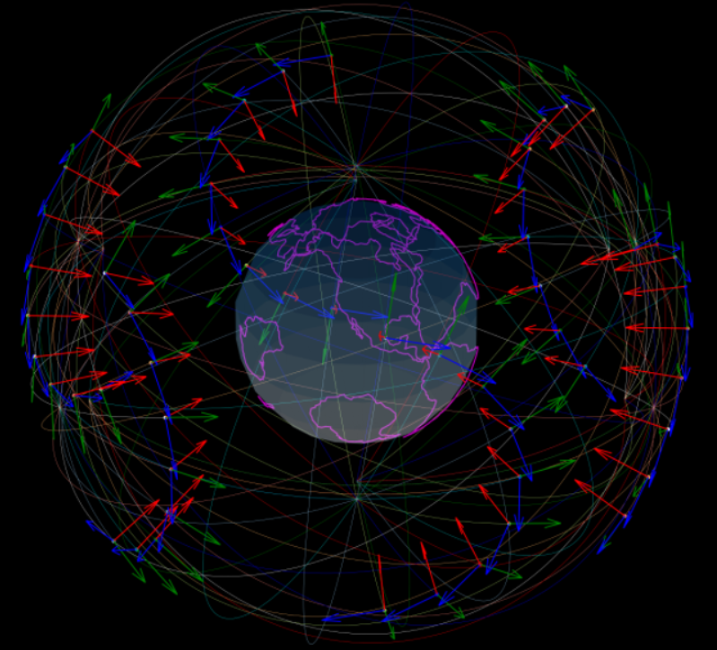

# AWP - Astrodynamics with Python



* [Video Explaining How To Use This Repository](https://youtu.be/yMJ_VU3jt7c)

The GitHub repository corresponding to the YouTube channel (https://www.youtube.com/AlfonsoGonzalezSpaceEngineering), which contains the following video series:

* [Space Engineering Podcast](https://www.youtube.com/playlist?list=PLOIRBaljOV8gYALpxUJywrHZuvZ9NFpz0)
* [Orbital Mechanics with Python](https://www.youtube.com/playlist?list=PLOIRBaljOV8gn074rWFWYP1dCr2dJqWab)
* [Fundamentals of Orbital Mechanics](https://www.youtube.com/playlist?list=PLOIRBaljOV8hBJS4m6brpmUrncqkyXBjB)
* [Mecánica Orbital con Python](https://www.youtube.com/playlist?list=PLOIRBaljOV8iGCAac3UnrXHu3tjKHjXSB)
* [Spacecraft Attitude Control with Python](https://www.youtube.com/playlist?list=PLOIRBaljOV8gsvlQ_GtiDRSBECHB2vvnp)
* [Numerical Methods with Python](https://www.youtube.com/playlist?list=PLOIRBaljOV8gMqhggseSHI9u2pldGZonA)

## Dependencies
* [Python 3.0+](https://www.python.org/)
* [SciPy](https://www.scipy.org/)
* [Matplotlib](https://matplotlib.org/stable/index.html)
* [SpiceyPy (SPICE Python Wrapper)](https://spiceypy.readthedocs.io/en/main/)
* [pytest](https://docs.pytest.org/en/6.2.x/)

### Installing Python dependencies
Python packages can be easily and conviniently installed using `pip` via the command line like so:
```sh
$ python3 -m pip install {package_name}
```
In the case of AWP, all Python dependencies can be installed in one command using the requirements.txt file as so:
```sh
$ python3 -m pip install -r requirements.txt
```


## Setting the `PYTHONPATH` and `AWP` Environment Variables
In order to use this repository path independently (can run any script from any directory), one must set the `PYTHONPATH` and `AWP` variables as the following:

* `PYTHONPATH`: Absolute path to your python_tools directory
```sh
# Two examples of how to set the PYTHONPATH variable

$ export PYTHONPATH=$PYTHONPATH:/home/alfonso/AWP/src/python_tools
# or
$ export PYTHONPATH=$PYTHONPATH:~/AWP/src/python_tools
``` 

* `AWP`: Absolute path to the base of this repository
```sh
# Two examples of how to set the AWP variable

$ export AWP=/home/alfonso/AWP
# or
$ export AWP=~/AWP
```

For convenience, these commands can be placed in a .bashrc file and thus will be automatically set anytime a new terminal session is begun.

## Running Example Usages
Once the dependencies are installed and environment variables are set, the example usage cases can be run (from the base path of this repository):

```sh
# ensure you are in the base path of this repository
$ pwd
/home/alfonso/AWP
# run the example usages
$ python3 example_usage/Spacecraft_hello_world.py
$ python3 example_usage/many_orbits.py
```

## Running Unit Tests
Again, once dependencies are installed and environment variables set, the unit tests can be run with the following command (from the base path of this repository):

```sh
# ensure you are in the base path of this repository
$ pwd
/home/alfonso/AWP
# run the unit tests using one of the following commands
$ pytest src/python_tools/unit_tests/ -vv
# or
$ python3 -m pytest src/python_tools/unit_tests/ -vv
```

The only difference between those two commands is that running `pytest` through the Python interpreter is that `python` [will add your current directory to sys.path](https://docs.pytest.org/en/6.2.x/usage.html#cmdline)
